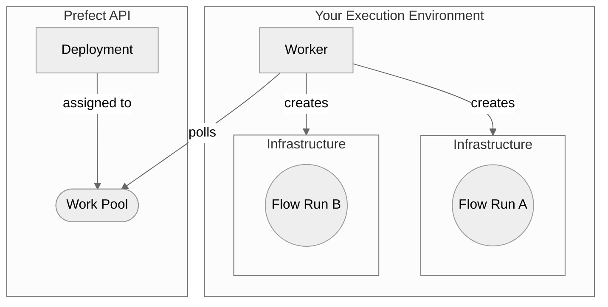
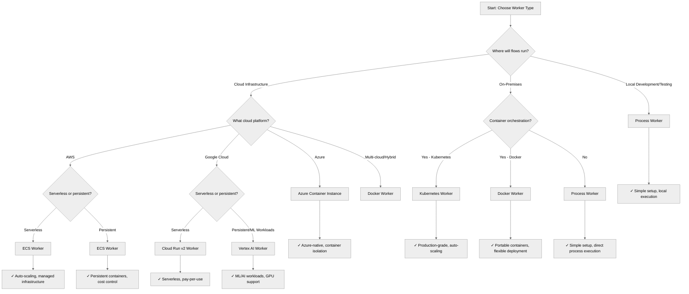

Workers are lightweight polling services that retrieve scheduled runs from a work pool and execute them.

Workers each have a type corresponding to the execution environment to submit flow runs to.
Workers can only poll work pools that match their type.
As a result, when deployments are assigned to a work pool, you know in which execution environment scheduled flow runs for that deployment will run.

The following diagram summarizes the architecture of a worker-based work pool deployment:



The worker is in charge of provisioning the _flow run infrastructure_.   

### Worker types

Below is a list of available worker types. Most worker types require installation of an additional package.

| Worker Type | Description | Required Package |
| --- | --- | --- |
| [`process`](https://reference.prefect.io/prefect/workers/process/) | Executes flow runs in subprocesses | |
| [`kubernetes`](https://reference.prefect.io/prefect_kubernetes/worker/) | Executes flow runs as Kubernetes jobs | `prefect-kubernetes` |
| [`docker`](https://reference.prefect.io/prefect_docker/worker/) | Executes flow runs within Docker containers | `prefect-docker` |
| [`ecs`](https://reference.prefect.io/prefect_aws/workers/ecs_worker/) | Executes flow runs as ECS tasks | `prefect-aws` |
| [`cloud-run-v2`](https://reference.prefect.io/prefect_gcp/workers/cloud_run_v2/) | Executes flow runs as Google Cloud Run jobs | `prefect-gcp` |
| [`vertex-ai`](https://reference.prefect.io/prefect_gcp/workers/vertex/) | Executes flow runs as Google Cloud Vertex AI jobs | `prefect-gcp` |
| [`azure-container-instance`](https://reference.prefect.io/prefect_azure/workers/container_instance/) | Execute flow runs in ACI containers | `prefect-azure` |
| [`coiled`](https://github.com/coiled/prefect-worker/blob/main/example/README.md) | Execute flow runs in your cloud with Coiled | `prefect-coiled` |

If you don't see a worker type that meets your needs, consider 
[developing a new worker type](/contribute/develop-a-new-worker-type/). See the [custom worker development guide](/contribute/develop-a-new-worker-type/) for advanced customization options.

## Choosing a Worker Type

Selecting the right worker type depends on your infrastructure requirements, scalability needs, and operational constraints. Use this decision tree to guide your choice:



### Worker Type Comparison

| Worker Type | Best For | Pros | Cons | Typical Use Cases |
|-------------|----------|------|------|-------------------|
| **Process** | Local development, simple deployments | • No additional dependencies<br>• Fast startup<br>• Easy debugging | • Limited isolation<br>• Single machine scaling<br>• No resource limits | Development, testing, simple automation |
| **Docker** | Portable containerized workloads | • Environment isolation<br>• Reproducible builds<br>• Flexible deployment | • Requires Docker setup<br>• Container overhead | CI/CD, multi-environment deployments |
| **Kubernetes** | Production-grade orchestration | • Auto-scaling<br>• High availability<br>• Resource management<br>• Production-ready | • Complex setup<br>• Kubernetes knowledge required | Large-scale production, microservices |
| **ECS** | AWS-native container orchestration | • AWS integration<br>• Managed infrastructure<br>• Auto-scaling | • AWS vendor lock-in<br>• ECS-specific configuration | AWS-centric architectures |
| **Cloud Run v2** | Google Cloud serverless containers | • Serverless scaling<br>• Pay-per-use<br>• Managed infrastructure | • GCP vendor lock-in<br>• Cold start latency | Event-driven workloads, cost optimization |
| **Vertex AI** | ML/AI workloads on Google Cloud | • GPU/TPU support<br>• ML-optimized<br>• Managed notebooks | • GCP vendor lock-in<br>• ML-specific use case | Machine learning, data science pipelines |
| **Azure Container Instance** | Azure-native container execution | • Azure integration<br>• Simple container deployment<br>• Pay-per-second billing | • Azure vendor lock-in<br>• Limited orchestration | Azure-centric simple containerization |

### Infrastructure Decision Factors

**Choose Process Worker when:**
- Developing or testing flows locally
- Running simple automation tasks
- Working in resource-constrained environments
- No containerization requirements

**Choose Docker Worker when:**
- Need environment isolation and reproducibility
- Deploying across multiple environments
- Using custom dependencies or system packages
- Want container portability without orchestration complexity

**Choose Kubernetes Worker when:**
- Running production workloads at scale
- Need high availability and fault tolerance
- Require advanced resource management and auto-scaling
- Have existing Kubernetes infrastructure

**Choose Cloud-Specific Workers when:**
- Leveraging cloud-native services and integrations
- Need managed infrastructure with minimal operational overhead
- Optimizing for cloud provider-specific features (serverless, GPU, etc.)
- Following cloud-first architectural patterns

### Interactive Worker Type Selection

When creating a work pool without specifying a `--type`, Prefect provides an interactive selection interface. This process guides you through choosing the appropriate worker type based on available options.

#### CLI Selection Process

The interactive selection appears when running:

```bash
prefect work-pool create "my-pool"
```

You'll see a table-based selection interface:

```
? What type of work pool infrastructure would you like to use? [Use arrows to move; enter to select]

> Infrastructure Type    Description
  ──────────────────────────────────────────────────────────────────
> Process               Execute flow runs in subprocesses on the worker
  Docker                Execute flow runs within Docker containers  
  Kubernetes            Execute flow runs as Kubernetes jobs
  ECS                   Execute flow runs as AWS ECS tasks
  Cloud Run v2          Execute flow runs as Google Cloud Run jobs
  Vertex AI             Execute flow runs as Google Cloud Vertex AI jobs
  Azure Container Inst. Execute flow runs in Azure Container Instances
```

**Navigation:**
- Use arrow keys (↑/↓) to move between options
- Press Enter to select the highlighted worker type
- Press Ctrl+C to cancel the operation

**Behind the Scenes:**
The CLI fetches worker metadata from the Prefect collections registry, which includes display names and descriptions for each available worker type. The selection process automatically filters options based on whether you're provisioning infrastructure (`--provision-infrastructure` flag).

### Troubleshooting Worker Type Selection

#### Common Issues and Solutions

**Issue: "Unknown work pool type" error**
```bash
Unknown work pool type 'my-type'. Please choose from process, docker, kubernetes, ecs, cloud-run-v2, vertex-ai, azure-container-instance.
```

**Solution:** Ensure you're using a valid worker type name. Check available types with:
```bash
prefect worker start --help
```

**Issue: Worker type inference fails**
```bash
Work pool 'my-pool' does not exist and no worker type was provided. Starting a process worker...
```

**Cause:** This occurs when:
- The specified work pool doesn't exist
- No `--type` flag is provided
- The system falls back to process worker as default

**Solution:** Either create the work pool first or specify the worker type explicitly:
```bash
prefect worker start --pool "my-pool" --type "docker"
```

**Issue: Missing integration package**
```bash
Could not find the Prefect integration library for the kubernetes worker in the current environment.
```

**Cause:** The required integration package isn't installed.

**Solution:** Install the required package or use the `--install-policy` flag:
```bash
# Install manually
pip install prefect-kubernetes

# Or let Prefect handle it
prefect worker start --pool "my-pool" --type "kubernetes" --install-policy "always"
```

**Issue: Worker type mismatch warning**
```bash
Worker type mismatch! This worker process expects type 'process' but received 'docker' from the server.
```

**Cause:** The worker type doesn't match the work pool's configured type.

**Solution:** Either:
- Start a worker with the correct type: `prefect worker start --pool "my-pool" --type "docker"`
- Or recreate the work pool with the desired type

#### Worker Type Inference Logic

Prefect uses the following priority order for determining worker type:

1. **Explicit `--type` flag** - Highest priority
2. **Work pool type inference** - If work pool exists, use its configured type
3. **Default fallback** - Falls back to "process" worker if neither above is available

The inference process ensures workers can start even when work pools don't exist, but this may not always match your intended infrastructure.

### Worker Type Selection Examples

#### Scenario 1: Local Development
```bash
# Create a simple work pool for local testing
prefect work-pool create "dev-pool" --type process

# Start a worker for development
prefect worker start --pool "dev-pool"
```

#### Scenario 2: Production Kubernetes Deployment
```bash
# Create a Kubernetes work pool with custom configuration
prefect work-pool create "prod-k8s-pool" --type kubernetes

# Start a Kubernetes worker with resource limits
prefect worker start --pool "prod-k8s-pool" --limit 10
```

#### Scenario 3: AWS ECS with Auto-Installation
```bash
# Let Prefect install the AWS integration automatically
prefect worker start --pool "aws-pool" --type ecs --install-policy always
```

#### Scenario 4: Multi-Environment Docker Setup
```bash
# Create work pools for different environments
prefect work-pool create "staging-docker" --type docker
prefect work-pool create "prod-docker" --type docker

# Start workers with environment-specific configurations
prefect worker start --pool "staging-docker" --work-queue "staging-queue"
prefect worker start --pool "prod-docker" --work-queue "prod-queue" --limit 5
```

#### Scenario 5: Interactive Work Pool Creation
```bash
# Let Prefect guide you through the selection process
prefect work-pool create "my-new-pool"
# Follow the interactive prompts to choose the best worker type
```


### Worker options

Workers poll for work from one or more queues within a work pool. If the worker references a work queue that doesn't exist, it is created automatically.
The worker CLI infers the worker type from the work pool.
Alternatively, you can specify the worker type explicitly.
If you supply the worker type to the worker CLI, a work pool is created automatically if it doesn't exist (using default job settings).

Configuration parameters you can specify when starting a worker include:

| Option                                            | Description                                                                                                                                 |
| ------------------------------------------------- | ------------------------------------------------------------------------------------------------------------------------------------------- |
| `--name`, `-n`                                    | The name to give to the started worker. If not provided, a unique name will be generated.                                                   |
| `--pool`, `-p`                                    | The work pool the started worker should poll.                                                                                               |
| `--work-queue`, `-q`                              | One or more work queue names for the worker to pull from. If not provided, the worker pulls from all work queues in the work pool.      |
| `--type`, `-t`                                    | The type of worker to start. If not provided, the worker type is inferred from the work pool.                                          |
| <span class="no-wrap">`--prefetch-seconds`</span> | The amount of time before a flow run's scheduled start time to begin submission. Default is the value of `PREFECT_WORKER_PREFETCH_SECONDS`. |
| `--run-once`                                      | Only run worker polling once. By default, the worker runs forever.                                                                          |
| `--limit`, `-l`                                   | The maximum number of flow runs to start simultaneously.                                                                                    |
| `--with-healthcheck`                                   | Start a healthcheck server for the worker.                                                                                    |
| `--install-policy`                                   | Install policy to use workers from Prefect integration packages.                                                                                    |

You must start a worker within an environment to access or create the required infrastructure to execute flow runs. 
The worker will deploy flow runs to the infrastructure corresponding to the worker type. For example, if you start a worker with 
type `kubernetes`, the worker deploys flow runs to a Kubernetes cluster.

Prefect must be installed in any environment (for example, virtual environment, Docker container) where you intend to run the worker or 
execute a flow run.

<Tip>
**`PREFECT_API_URL` and `PREFECT_API_KEY`settings for workers**

    `PREFECT_API_URL` must be set for the environment where your worker is running. When using Prefect Cloud, you must also have a user or service account 
    with the `Worker` role, which you can configure by setting the `PREFECT_API_KEY`.
</Tip>

### Worker status

Workers have two statuses: `ONLINE` and `OFFLINE`. A worker is online if it sends regular heartbeat messages to the Prefect API. 
If a worker misses three heartbeats, it is considered offline. By default, a worker is considered offline a maximum of 90 seconds 
after it stopped sending heartbeats, but you can configure the threshold with the `PREFECT_WORKER_HEARTBEAT_SECONDS` setting.

### Worker logs
<span class="badge cloud"></span> Workers send logs to the Prefect Cloud API if you're connected to Prefect Cloud.

- All worker logs are automatically sent to the Prefect Cloud API
- Logs are accessible through both the Prefect Cloud UI and API
- Each flow run will include a link to its associated worker's logs

### Worker details
<span class="badge cloud"></span> The **Worker Details** page shows you three key areas of information:

- Worker status
- Installed Prefect version
- Installed Prefect integrations (e.g., `prefect-aws`, `prefect-gcp`)
- Live worker logs (if worker logging is enabled)

Access a worker's details by clicking on the worker's name in the Work Pool list.

### Start a worker

Use the `prefect worker start` CLI command to start a worker. You must pass at least the work pool name. 
If the work pool does not exist, it will be created if the `--type` flag is used.

```bash
prefect worker start -p [work pool name]
```

For example:

```bash
prefect worker start -p "my-pool"
```

Results in output like this:

```bash
Discovered worker type 'process' for work pool 'my-pool'.
Worker 'ProcessWorker 65716280-96f8-420b-9300-7e94417f2673' started!
```

In this case, Prefect automatically discovered the worker type from the work pool.
To create a work pool and start a worker in one command, use the `--type` flag:

```bash
prefect worker start -p "my-pool" --type "process"
```

```bash
Worker 'ProcessWorker d24f3768-62a9-4141-9480-a056b9539a25' started!
06:57:53.289 | INFO    | prefect.worker.process.processworker d24f3768-62a9-4141-9480-a056b9539a25 - Worker pool 'my-pool' created.
```

In addition, workers can limit the number of flow runs to start simultaneously with the `--limit` flag.
For example, to limit a worker to five concurrent flow runs:

```bash
prefect worker start --pool "my-pool" --limit 5
```

import { HELM } from "/snippets/resource-management/helm.mdx"
import { workers } from "/snippets/resource-management/vars.mdx"

<HELM name="workers" href={workers.helm} />

### Configure prefetch

By default, the worker submits flow runs 10 seconds before they are scheduled to run. 
This allows time for the infrastructure to be created so the flow run can start on time.

In some cases, infrastructure takes longer than 10 seconds to start the flow run. You can increase the prefetch time with the
`--prefetch-seconds` option or the `PREFECT_WORKER_PREFETCH_SECONDS` setting.

If this value is _more_ than the amount of time it takes for the infrastructure to start, the flow run will _wait_ until its 
scheduled start time.

### Polling for work

Workers poll for work every 15 seconds by default. You can configure this interval in your [profile settings](/v3/develop/settings-and-profiles/) 
with the
`PREFECT_WORKER_QUERY_SECONDS` setting.

### Install policy

The Prefect CLI can install the required package for Prefect-maintained worker types automatically. Configure this behavior 
with the `--install-policy` option. The following are valid install policies:

| Install Policy | Description |
| --- | --- |
| `always` | Always install the required package. Updates the required package to the most recent version if already installed. |
| `if-not-present` | Install the required package if it is not already installed. |
| `never` | Never install the required package. |
| `prompt` | Prompt the user to choose whether to install the required package. This is the default install policy. 
If `prefect worker start` is run non-interactively, the `prompt` install policy behaves the same as `never`. |

### Further reading

- See how to [daemonize a Prefect worker](/v3/advanced/daemonize-processes/).

- See more information on [overriding a work pool's job variables](/v3/deploy/infrastructure-concepts/customize).


---------
